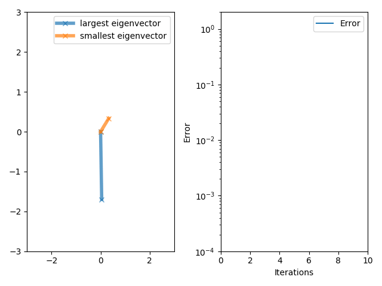

|NAME     |TOPIC       |TITLE                                                    |
|:-------:|:----------:|:-------------------------------------------------------:|
|Eli Scott|Power Method|Background, Analysis, and Application of the Power Method|

# Power Method
## Table of Contents
* [Overview](#overview)
* [Background](#background)
* [Power Method Overview](#power-method-overview)
* [Improvements](#improvements)
* [Strengths and Limitations](#strengths-and-limitations)
* [Common Applications](#common-applications)
* [References](#references)
## Overview
The power method is an algorthim which is utilized in solving eigenvalue problems. The power method is an iterative algorithm that finds the dominant eigenvalue and eigenvector of a given matrix [1]. This becomes an effective algorithm when only the dominant eigenvalue and eigenvector is desired.
## Background
An eigenvalue problem for which this algorithm is used can be defind as [1]:
$$(A-\lambda I)x = 0$$
where A is an abritrary square matrix, I is the identity matrix, and $\lambda$ and and x are the corresonding eigenvalues and eigenvectors which solve the equation. Eigenvalues are the values for which $A\lambda = Ax$ is a true statement. Thus, mulitplying an eigenvector by the matrix is equivalent to multiplying the eigenvector with its corresponding eigenvector. If A is an nxn matrix (having n number rows and n number columns), then matrix A can have up to n number eigenvalues and eigenvectors. Therefore, as matrix A gets arbitrarily large, it can become computationaly expensive to compute all of the eigenvalues and eigenvectors for a given matrix. Consequently, for many problems, only the dominant eigenvalue and eigenvector is desired. Henceforth, the power method was devised which cuts out much unneccesary computation by only solving for the dominant eigenvector and eigenvalue. 
## Power Method Overview
The power method starts by choosing a random vector, $x_0$, such that [2]:
$$x_0 = a_1x_1 + a_2x_2 + ... + a_nx_n$$
where $a_1, a_2, ..., a_n$ are random numbers and $x_1, x_2, ..., x_n$ are the eigenvectors of A correspoding respectively to the eigenvalues $\lambda_1, \lambda_2, ..., \lambda_n$ such that $|\lambda_1| >= |\lambda_2| >= ... >= |\lambda_n|$. Power method utilizes the mathmatic property [2]:
$$Ax_0 = a_1\lambda_1x_1 + a_2\lambda_2x_2 + ... + a_n\lambda_nx_n$$
Then, by iteratively multiplying a given matrix A to the random vector, $x_0$, the resulting vector will converge to the dominant eigenvector [2]:
$$A^kx_0 = a_1\lambda_1^kx_1 + a_2\lambda_2^kx_2 + ... + a_n\lambda^k_nx_n$$
$$A^kx_0 = \lambda_1^k(a_1x_1 + a_2(\frac{\lambda_2}{\lambda_1})^kx_2 + ... + a_n(\frac{\lambda_n}{\lambda_1})^kx_n)$$
As k gets arbitrarily large, $\lim_{k\to\infty} (\frac{\lambda_2}{\lambda_1})^k = 0$ and $\lim_{k\to\infty} (\frac{\lambda_n}{\lambda_1})^k = 0$ since $|\lambda_1| >= |\lambda_2| >= ... >= |\lambda_n|$. This simplifies the equation leaving:
$$A^kx_0 = \lambda_1^ka_1x_1$$
From this equation, $\lambda_1$ and $x_1$, which are the dominant eigenvalue and eigenvector, are obtained. The process of approaching the dominant eigenvector through each iteration can be seen by:

 [3]

## Improvements

## Strengths and Limitations

## Common Applications

## References
1. 0.3 POWER METHOD FOR APPROXIMATING EIGENVALUES. (n.d.). [https://ergodic.ugr.es/cphys/LECCIONES/FORTRAN/power_method.pdf](https://ergodic.ugr.es/cphys/LECCIONES/FORTRAN/power_method.pdf)
2. Lecture # 10 The Power Method for Eigenvalues. (n.d.). Retrieved December 7, 2023, from [https://www.cse.psu.edu/~b58/cse456/lecture10.pdf](https://www.cse.psu.edu/~b58/cse456/lecture10.pdf)
3. 
